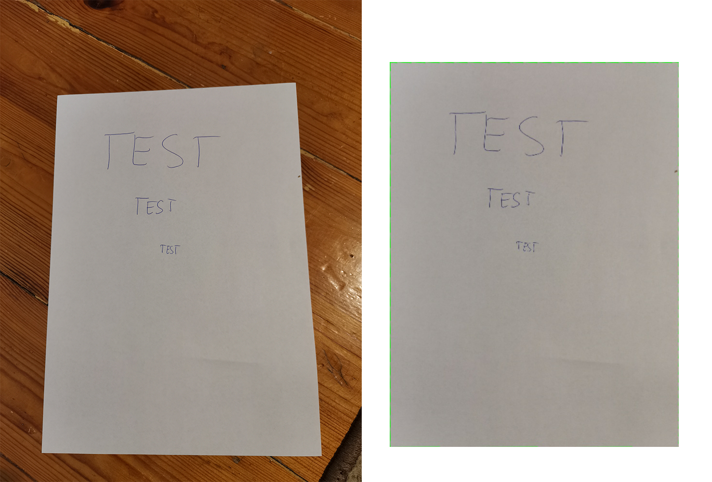
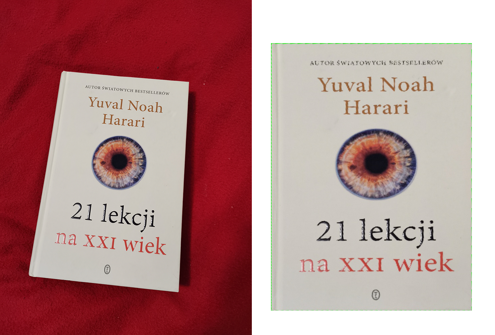

# Description
The purpose of this program is detecting, straightening and trimming A4 paper sheets.

# Examples

Demo 1:


Demo 2:


# Running program
1. Compile code using ```make```
2. Run it ```./program [filename]```

### Executions:
Let's ```filename.jpg```  be image containing paper sheet.
- ```./program filename.jpg``` - processes ``` filename.jpg``` and saves output to ```output.txt```

- ```./program filename.jpg -o custom_output.txt``` - processes ```filename.jpg``` and saves output to file which filename is provided by user - in this case it's ```custom_output.txt```